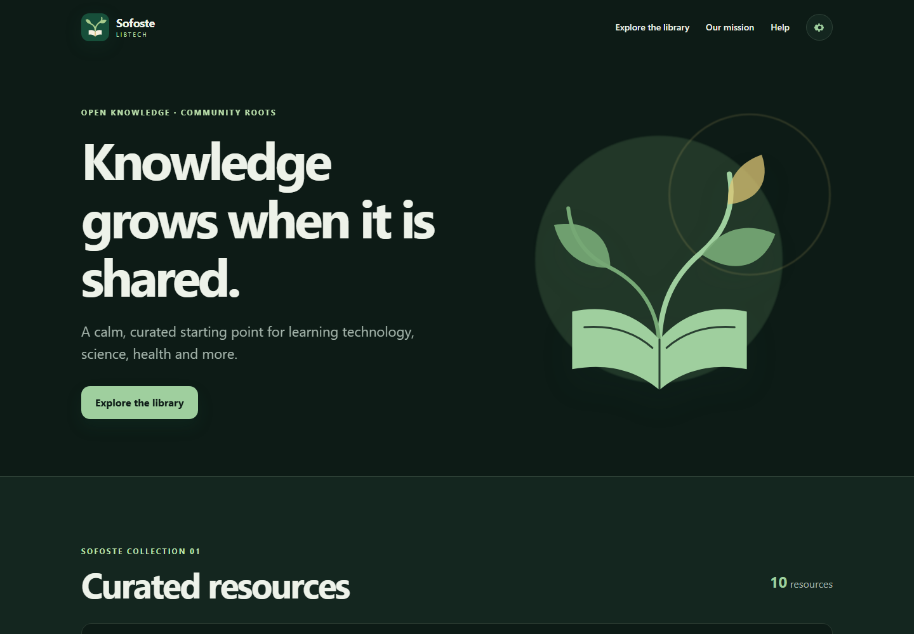

# Sofoste LibTech

> Open knowledge. Community roots.

Sofoste LibTech is a small, curated library of trustworthy learning resources. It began in 2021 as an educational PHP experiment for Mangwa and Abakwa. Version 2 keeps that purpose and rebuilds the project as a responsive, accessible web application that is pleasant to use and simple to study.

[Download the latest release](https://github.com/sofoste93/sofosteLibTech/releases/latest)



## What you can do

- Search a real catalogue and filter it by subject.
- Save useful resources locally in your browser.
- Switch between English and French.
- Choose a light, dark or system theme and reduce animations.
- Use the library comfortably from a phone, tablet or computer.
- Reopen the application shell offline after the first visit.
- Read and modify a deliberately small PHP, HTML, CSS and JavaScript codebase.

Bookmarks and preferences remain in the browser. The application has no account, analytics or remote database. Resource links open the original provider website.

## Quick start

Sofoste LibTech requires **PHP 8.1 or newer** for the educational PHP edition.

### Windows

Double-click `start-windows.bat`, then open [http://localhost:8080](http://localhost:8080).

### Linux and macOS

```bash
chmod +x start-unix.sh
./start-unix.sh
```

Then open [http://localhost:8080](http://localhost:8080).

You can also start it directly:

```bash
php -S 0.0.0.0:8080
```

### Open it on a phone

1. Connect the computer and phone to the same Wi-Fi.
2. Start LibTech with one of the commands above.
3. Find the computer's local address, such as `192.168.1.24`.
4. Open `http://192.168.1.24:8080` on the phone.
5. Allow PHP through the private-network firewall if your operating system asks.

Guest Wi-Fi networks sometimes isolate devices from one another. Use the normal trusted home network in that case.

## Server-free static edition

The release also contains a static ZIP that works without PHP. Extract it and open `index.html`, or publish its contents on any static web host.

To build that edition yourself:

```bash
php tools/build-static.php
```

The generated site is written to `dist/`.

## Learner tour

The project avoids frameworks so each layer remains visible:

```text
assets/
  app.js               browser interactions and local preferences
  styles.css           responsive Serpent Pro design system
data/
  resources.php        curated catalogue data
src/
  Library.php          searchable PHP catalogue service
  translations.php    English and French interface text
tests/
  run.php              dependency-free behaviour checks
tools/
  build-static.php     PHP-to-static export
index.php              validation, server rendering and page structure
service-worker.js      offline application shell
```

The important learning path is:

1. `index.php` validates query parameters and asks `Library` for matching resources.
2. PHP renders useful HTML even when JavaScript is disabled.
3. `app.js` enhances the page with instant filtering, favourites and settings.
4. Browser-only information is stored with `localStorage`.
5. The service worker caches the local application shell after the first successful visit.

The source includes focused comments around decisions that are useful to learners. It avoids comments that merely repeat the code.

## Add a resource

Open `data/resources.php` and add an item with a unique ID, HTTPS URL and one of the existing categories:

```php
[
    'id' => 'example-course',
    'title' => 'Example Course',
    'description' => 'A concise explanation of the resource.',
    'provider' => 'Example University',
    'url' => 'https://example.org/course',
    'category' => 'science',
    'level' => 'beginner',
    'tags' => ['example', 'course'],
],
```

Then run the checks:

```bash
php tests/run.php
php tools/build-static.php
```

## Quality and accessibility

Continuous integration checks PHP 8.1, 8.2, 8.3 and 8.4. The interface uses semantic landmarks, keyboard-visible focus, native dialogs, responsive layouts and reduced-motion support. No production dependency or CDN is required.

## History

The original `1.0` tag remains available as a snapshot of the 2021 learning project. See [CHANGELOG.md](CHANGELOG.md) for the restoration notes.

## License

Released under the [MIT License](LICENSE).
